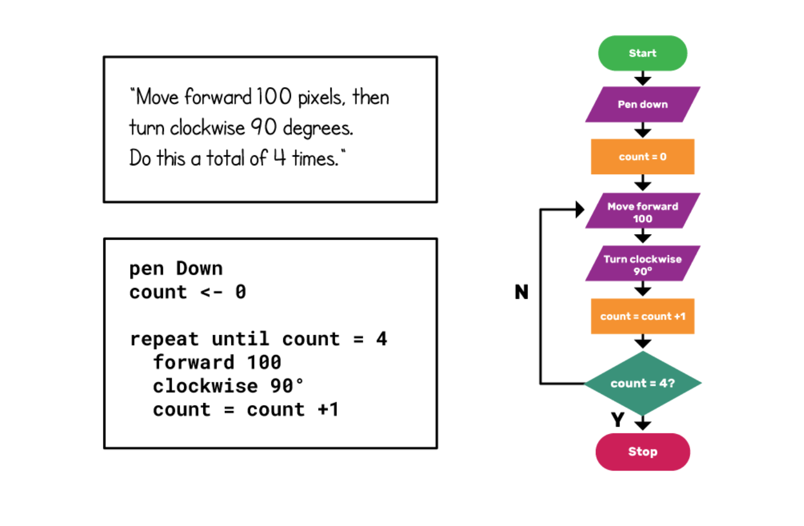
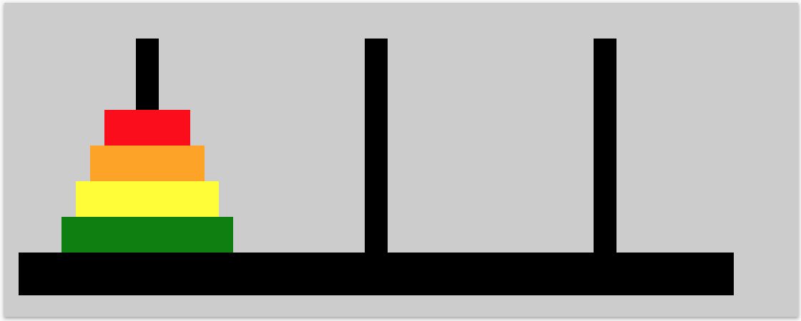

### Coding Workstation [Algorithms] 📝
____________________________________________________________________________________
Algorithm Design is **1** of **4** parts of the computational thinking model. An algorithm can simply be defined like this: An algorithm is set of instructions that precisely describe an activity. The instructions should be such that any ‘actor’ could follow to produce the same output. An ‘actor’ refers to anything, whether human or computer, that is capable of computation.

Algorithms are used every day all around us to do all sorts of things, such as finding a route from A to B, searching the internet for the most appropriate pages, or recommending movies based on your past viewing.

In fact, it is difficult to think of a task performed by your computer that does not use algorithms. Algorithms are unambiguous specifications for performing calculation, data processing, automated reasoning, and other tasks.

While we could substitute the words instructions for algorithm, there are some important characteristics of algorithms that make them distinct.

**An algorithm:**

1. Must be sufficiently precise and unambigious: every step must be clear to the actor implementing the algorithm.
2. Must be repeatable, producing predictable outcomes based on the same inputs.
3. Can be represented in a range of forms, including natural language, pseudocode, flowcharts, or symbols.

### Solve the Tower of Hanoi Puzzle
____________________________________________________________________________________
The Tower of Hanoi is a puzzle that consists of three rods and a number of disks of different sizes, which can slide onto any rod. The puzzle starts with the disks in a neat stack in ascending order of size on one rod, the smallest at the top, thus making a conical shape.

The rules one must follow when solving the tower puzzle are:
1. Disks must be removed one at a time from the top of one tower and placed onto the top of another tower.
2. No disk can be larger than any disk below it (i.e., the disks on each tower make a pyramid shape).

### How To Submit the Tower of Hanoi Puzzle
____________________________________________________________________________________
1. Open up a Google document
2. Write out your algorithm for the Tower of Hanoi Puzzle
3. Submit it on Google Classroom
4. Now solve it with this interactive version of the Hanoi puzzle 
- https://www.mathsisfun.com/games/towerofhanoi.html